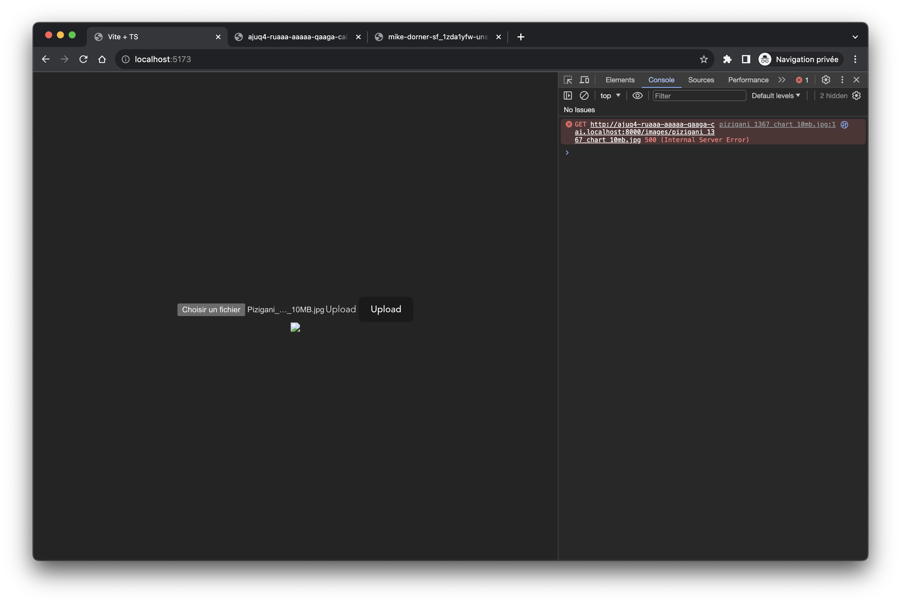
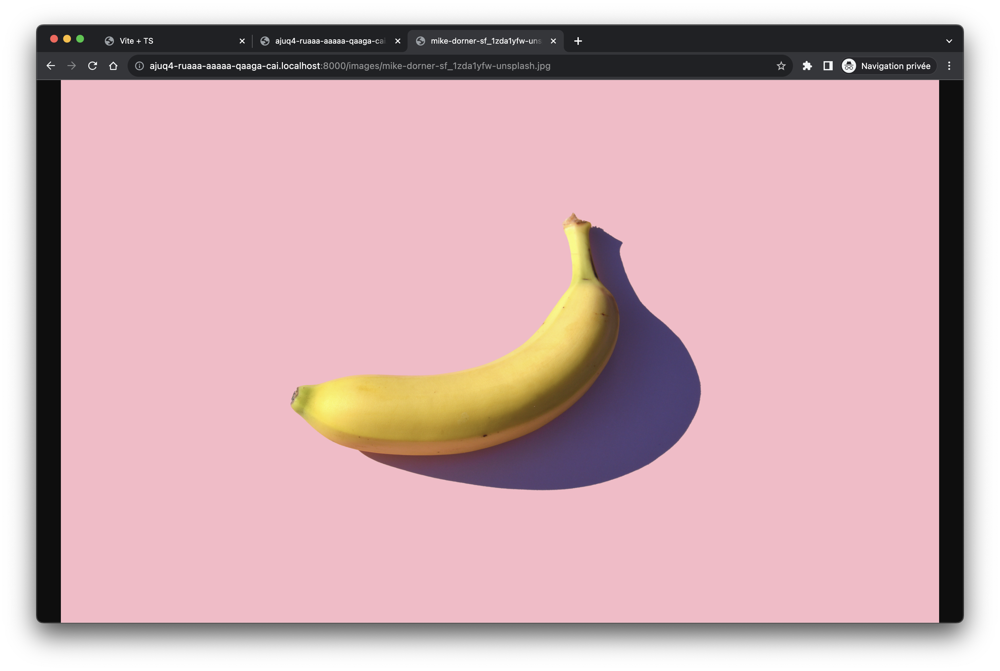

# stable_structure_execution_limit

A sample repo to demo following issue with stable structure v2:

> Replica Error (5): "IC0522: Canister ajuq4-ruaaa-aaaaa-qaaga-cai exceeded the instruction limit for single message execution."

## How-to?

```
git clone https://github.com/peterpeterparker/stable_structure_execution_limit
cd stable_structure_execution_limit
npm ci
dfx start
dfx deploy stable_structure_execution_limit_backend --specified-id ajuq4-ruaaa-aaaaa-qaaga-cai
npm run dev
```

Open browser [http://localhost:5173/](http://localhost:5173/) and its console debugger.

Upload a 10mb file such as [Pizigani_1367_Chart_10MB.jpg](./assets/Pizigani_1367_Chart_10MB.jpg) provided in the repo.

The upload process seem to successed but, downloading the image through the `http_request` will fails with a 500 error.



If you try to open the link printed to the console in a separate tab, it will display an execution limit error.



It is worth to note that same process with a smaller file such [mike-dorner-sf_1ZDA1YFw-unsplash.jpg](./assets/mike-dorner-sf_1ZDA1YFw-unsplash.jpg) works out.


